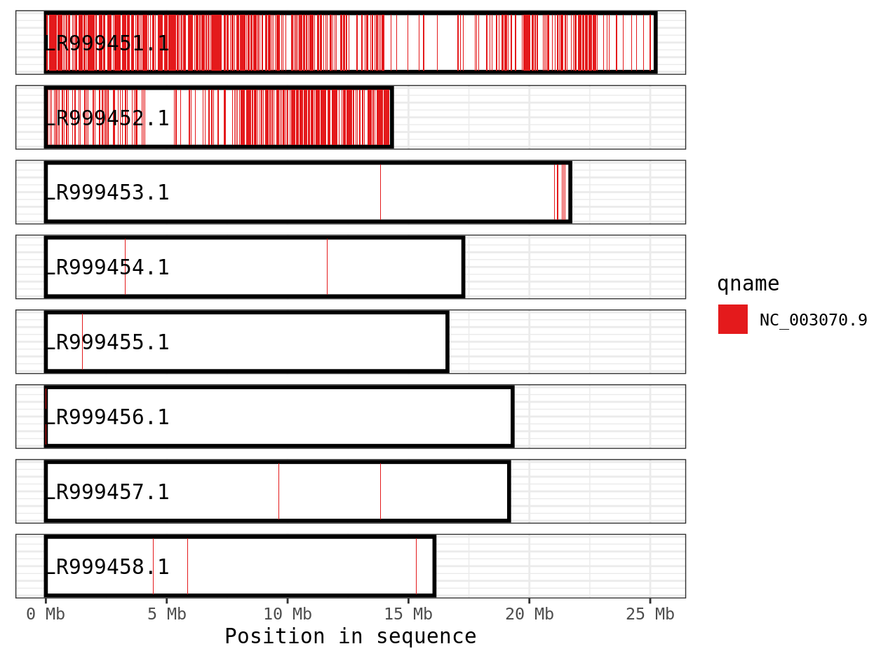

Before we start working on genome assembly, we need to clear space on the server. 
Currently we're using almost all of the space in the home directory. Once
that fills up, no one will be able to use the server. Please follow
these steps to remove unnecessary files. Before you start working on 
the assembly portion of this lab, you will need to delete enough files
so that your directory is less than 1 GB. After you have done that,
call me over so I can check your directory and approve it.

1) Login to the server. Source the bash.rc file to use modules.
2) To check how much you are storing using the du command
```bash
du -h --max-depth=1
```
```output
4.0K	./.config
272K	./.local
702M	./R
0	./.licenses
0	./.mii
4.0K	./.ncbi
0	./bin
28K	./.cache
64K	./.java
4.0K	./.ssh
109M	./lab_9
811M
```
This shows how much is stored in each folder. The R directory 
contains all of your R packages, so you can leave that. You'll
probably have a fair amount in lab_* directories. Please delete those entirely
or just delete all the large files in them. You will probably also
have a large amount in the .local directory. This contains
the saved sessions from Rstudio server. Before we clear that,
we should open Rstudio and save everything you need.
3) Open Rstudio server. In the top left, you will have
your scripts. If you have an unsaved scripts, save them to your
home directory with appropriate names. 
4) Clear all objects from your workspace using the broom icon (on the right).
5) Restart your session by going to "Session"->"Quit Session". When prompted,
DO NOT save your workspace. It will prompt you to start a new session which 
should be entirely clean.
6) You've cleared you Rstudio, but there still might be files saved 
from previous suspended sessions. Go into the .local directory and run
'du -h'. Look through the output for directories with > 1M. If you find any
call me (Greg) over to delete them (to make sure you don't delete something essential).
7) Check with Greg to make sure that you've cleared everything you need to.

****

With that out of the way, lets work on genome assembly. 
Return to your home directory and download some example data.
```bash
cd ~
mkdir lab_10
cd lab_10
mkdir velvet
wget https://zenodo.org/api/records/582600/files-archive -O velvet_files.zip
unzip velvet_files.zip
```

We're going to run a de novo assembly of a simulated <i>Staphylococcus aureus</i> genome.
This species has a genome only 197,394 bp so its relatively simple. 
The first step is to filter our reads. If we don't remove low quality reads or reads with
adapter sequences we can incorporate errors into our assembly.
```bash
module load fastp
fastp --in1 mutant_R1.fastq --in2 mutant_R2.fastq --stdout > mutant_bothreads.fastq
```
You may notice we're outputting only a single file from fastp. In this case,
we want to generate an interleaved fastq file that has both R1 and R2 in the 
same file. This is needed for velvet.
```bash
module load velvet
#This first step breaks our reads into kmers of length 29
velveth mutant 29 -shortPaired -fastq -interleaved mutant_bothreads.fastq
#This second step assembles the kmers
velvetg mutant
```
We've now assembled our reads! Hurray! The main output of this is the
contigs.
```bash
cd mutant
head contigs.fa
```
```output
>NODE_1_length_29_cov_1.000000
AGTCGGTTGCTGAAGTATCACAGGGCCATGTCCCTCAACTTCTCACAATAAGAAATA
>NODE_2_length_171_cov_26.801170
GTTGGTAACATTTATACAGGATCATTATACTTAAGTTTAATTTCGTTATTACAGAACCAC
ACATTCCAACCAGAAGAGAAAGTATGTCTATTTAGTTATGGTTCAGGAGCAGTAGGAGAA
ATCTTTAGTGGTTCAATCGTTAAAGGATATGACAAAGCATTAGATAAAGAGAAACACTTA
AATATGCTAGAATCTAGAG
>NODE_5_length_29_cov_1.000000
ATACTGTGCAACCGCTTCAATATCTTTAAGAAATTGACGGTCATATGTAATGGATGG
>NODE_6_length_40_cov_1.000000
```

This is your assembly in fasta format. Each contig is labelled
with a node number (just so it has an ID number), the length
and the coverage. 
We can also look at the stats table. I'm using a cut command
to only print out the first 7 columns, because the columns after that
are not useful.
```bash
head stats.txt | cut -f 1-7
```
```output
ID      lgth    out     in      long_cov        short1_cov      short1_Ocov     short2_cov
1       29      1       1       0.000000        1.000000        1.000000        0.000000
2       171     2       2       0.000000        26.801170       24.830409       0.000000
3       9       2       1       0.000000        28.000000       27.000000       0.000000
4       4       2       1       0.000000        26.250000       25.250000       0.000000
5       29      1       1       0.000000        1.000000        1.000000        0.000000
6       40      1       1       0.000000        1.000000        1.000000        0.000000
7       29      1       1       0.000000        1.000000        1.000000        0.000000
8       29      1       1       0.000000        9.103448        9.103448        0.000000
9       29      1       1       0.000000        1.000000        1.000000        0.000000
```
This tells you the length of your contigs and the amount of coverage or the number
of times was sequenced. 

### Questions
- How many contigs are there in the contigs.fa file? How many are listed in the stats.txt file? Why are these numbers different?
- What is the total length of the contigs? How does that compare to the expected length of 197,394 bp?


We can also use another program to get more stats on the assembly. We're going to use
QUAST (Quality Assessment Tool). QUAST generates reports about the size of your contigs, but
additionally you can give it a reference genome and it will compare your assembly to the reference. This can show you if your genome assembly is the full size you expect it to be. We're going to give QUAST the wild type reference genome and see how our assembly compares.

```bash
cd ..
module load StdEnv/2020  gcc/9.3.0 quast/5.2.0
quast -o mutant_quast -r wildtype.fna mutant/contigs.fa
```

The output of QUAST is text files, but it also has HTML reports. Download the entire
mutant_quast directory to your desktop using scp, and then open icarus.html. 
In the QUAST report section, it includes some important graphs.


This graph shows the cumulative length of contigs starting with the longest and moving shorter, in the red line. The grey line is the total length of the reference genome. In an
ideal world, the red line would reach the grey line quickly, showing that the de novo assembly
is the same length as the reference genome and that most of that length is in only a few contigs. 


This is Nx plot. Here we are again ordering our contigs from largest to smallest. The X axis is the contig percentile (i.e. longest to shortest), and the y axis is the length of the contig
in that position. We often report the N50 number, is defined by the length of the shortest contig for which longer and equal length contigs cover at least 50 % of the assembly. 

### Question
- What is N90 number for this assembly?
- Look at the contig alignment viewer. What is the most obvious difference between this 
assembly and the reference?
- What is an L50, and what is the L50 for your assembly?
- How many mismatches are there between your assembly and the reference?
- Repeat the velvet genome assembly with a kmer size of 53 and 93. Of the three sizes, which 
produces the best assembly? 

For our next section, we're going to use hifi data to assemble an E. coli genome. We're not going to do filtering for this set because the quality is already great and it doesn't actually remove anything, but you should run it for your own projects.
```bash
cd ~/lab_10
cp /project/ctb-grego/sharing/lab_10/ecoli_hifi.fastq.gz ./
module load StdEnv/2020 hifiasm

hifiasm ecoli_hifi.mini.fastq.gz -l0 -t 10 -o ecoli_hifi
awk '/^S/{print ">"$2;print $3}' ecoli_hifi.bp.p_ctg.gfa > ecoli_hifi.bp.p_ctg.fa
```
Since the hifi reads are so long and accurate, it allows for the independent assembly
of both parental haplotypes. Since this is a bacteria, it is haploid so we've given,
it the -l0 option to prevent it from producing two assemblies. The -t 10 option
tells it to use 10 cores.

You'll notice as hifiasm runs it produces a histogram of sequence depths. In most cases,
the mode of that distribution is the coverage of the sample. From that, we can see that we've 
got roughly 15X coverage, similar to the illumina data we used earlier. The last awk command
converts the gfa (which contains extra information) into a normal fasta file.

Lets use quast to look at genome quality, but first we should download a genome to compare it to.
```bash
module load StdEnv/2023 gcc/12.3 sra-toolkit/3.0.9
curl -o ecoli_ref.zip 'https://api.ncbi.nlm.nih.gov/datasets/v2alpha/genome/accession/GCF_000005845.2/download?include_annotation_type=GENOME_FASTA&include_annotation_type=GENOME_GFF&include_annotation_type=RNA_FASTA&include_annotation_type=CDS_FASTA&include_annotation_type=PROT_FASTA&include_annotation_type=SEQUENCE_REPORT&hydrated=FULLY_HYDRATED'
unzip  ecoli_ref.zip

quast -o hifi_quast -r ncbi_dataset/data/GCF_000005845.2/GCF_000005845.2_ASM584v2_genomic.fna ecoli_hifi.bp.p_ctg.fa
```
Download the hifi_quast directory to your desktop, open icarus.html.

### Questions
- How many contigs are in your assembly?
- What is the N50 of the assembly? 
- Would you say this is a better or worse genome assembly than the velvet assembly?


Now that we have a genome the next step is to see where genes are. To do this, we need to annotate the genome.
This is a challenging problem. There are several different approaches:
1) Sequencing mRNA and using that to guide what genomic regions are transcribed, including splicing patterns.
2) Using a model to look for gene-like sequence motifs.
3) Comparing to other known gene models.
4) Comparing between closely related species genomes and looking for homologous sequences.

There are multiple different programs that take different combinations of the previous approaches. For 
eukaryotes, MAKER is a common choice. For prokaryotes, the situation is simpler because the genomes are smaller, 
more gene dense and don't contain introns. We're going to use PROKKA to annotate our new genome. 

```bash
module load StdEnv/2020  gcc/9.3.0 prokka
prokka ecoli_hifi.bp.p_ctg.fa
```

Prokka compares the sequences to a set of known prokaryotic genes in UniProt and it also
looks for more distant similarity to any gene in an annotated prokaryotic genome. Based on
this similarity, it labels genes by their likely function. 

### Questions
- How many genes did prokka annotate?
- Find a gene annotated in both the reference genome and your new genome. Find a gene that is in your new
genome, but not the reference genome.

****

In the last section, we're going to align two whole genome sequences. For short reads,
we used BWA-mem, but for longer sequences we need to use a different program, for example
minimap2. For this section, we're going to download two different genomes from the 
Arabidopsis genus. 

```bash
cd ~/lab_10
mkdir genome_comparison
cd genome_comparison/
curl --output a_thaliana.zip 'https://api.ncbi.nlm.nih.gov/datasets/v2alpha/genome/accession/GCF_000001735.4/download?include_annotation_type=GENOME_FASTA&include_annotation_type=GENOME_GFF&include_annotation_type=RNA_FASTA&include_annotation_type=CDS_FASTA&include_annotation_type=PROT_FASTA&include_annotation_type=SEQUENCE_REPORT&hydrated=FULLY_HYDRATED'

curl --output a_arenosa.zip 'https://api.ncbi.nlm.nih.gov/datasets/v2alpha/genome/accession/GCA_905216605.1/download?include_annotation_type=GENOME_FASTA&include_annotation_type=GENOME_GFF&include_annotation_type=RNA_FASTA&include_annotation_type=CDS_FASTA&include_annotation_type=PROT_FASTA&include_annotation_type=SEQUENCE_REPORT&hydrated=FULLY_HYDRATED'
```

```bash
module load minimap2
minimap2 -cx asm20 \
  ncbi_dataset/data/GCA_905216605.1/GCA_905216605.1_AARE701a_genomic.fna \
  ncbi_dataset/data/GCF_000001735.4/GCF_000001735.4_TAIR10.1_genomic.fna \
  > arabidopsis_aligned.paf
head arabidopsis_aligned.paf | cut -f 1-12
```
```output
NC_003070.9     30427671        302984  342050  -       LR999451.1      25224288        123630  170102  35580   47816   60
NC_003070.9     30427671        25069147        25095539        +       LR999452.1      14316399        7694740 7721381 24575   27066   60
NC_003070.9     30427671        5562728 5595170 +       LR999451.1      25224288        6335141 6371781 29511   37557   60
NC_003070.9     30427671        701442  728409  +       LR999451.1      25224288        820561  849097  25132   29082   60
NC_003070.9     30427671        27917258        27951438        +       LR999452.1      14316399        11374022        11403129        26332  35248  60
NC_003070.9     30427671        5224185 5256648 +       LR999451.1      25224288        5964211 5997757 29202   34577   60
NC_003070.9     30427671        11246938        11276499        -       LR999451.1      25224288        15608823        15639766        26174  32415  60
NC_003070.9     30427671        17732524        17756114        +       LR999451.1      25224288        18733693        18757375        21903  24129  60
NC_003070.9     30427671        5733060 5756911 +       LR999451.1      25224288        6524999 6548507 21628   24502   60
NC_003070.9     30427671        29038801        29064917        +       LR999452.1      14316399        12577980        12605368        23429  28506  60
```

This produces a .paf file, or paired mapping format file. The alignment is in many small pieces, representing
small chunks of the genomes where they are aligned. 
| Column | Name    | Data Type | Description                                            |
|--------|---------|-----------|--------------------------------------------------------|
| 1      | qname   | string    | Query sequence name                                    |
| 2      | qlen    | int       | Query sequence length                                  |
| 3      | qstart  | int       | Query start coordinate (0-based)                       |
| 4      | qend    | int       | Query end coordinate (0-based)                         |
| 5      | strand  | char      | ‘+’ if query/target on the same strand; ‘-’ if opposite|
| 6      | tname   | string    | Target sequence name                                   |
| 7      | tlen    | int       | Target sequence length                                 |
| 8      | tstart  | int       | Target start coordinate on the original strand         |
| 9      | tend    | int       | Target end coordinate on the original strand           |
| 10     | nmatch  | int       | Number of matching bases in the mapping                |
| 11     | alen    | int       | Number of bases, including gaps, in the mapping        |
| 12     | mapq    | int       | Mapping quality (0-255, with 255 if missing)           |

By default, it doesn't actually output the 
aligned sequences (unlike SAM format), it just tells you were the two sequences are aligned. This
is useful for telling where orthologous sequences are between the two genomes. In almost any case,
you will also get extra alignment matches between other random chunks of the genome. To understand the
broad synteny patterns (i.e. which chromosome in A. arenosa is orthologous to which chromosome in A. thaliana)
you need to visualize the matches.

We're going to the pafr package to show how the two genomes align. Open Rstudio and run the following:
```R
install.packages("pafr")
library(pafr)

ali <- read_paf("/project/ctb-grego/owens/test/lab_10/genome_comparison/arabidopsis_aligned.paf")
ali
```
```output
pafr object with 17766 alignments (73.9Mb)
 7 query seqs
 8 target seqs
 12 tags: NM, ms, AS, nn, tp, cm, s1, s2, de, zd, rl .
```
The pafr package has some tools for visualizing the alignments. First is a dotplot,
which shows where alignments are relative to each genome.
```R
dotplot(ali, label_seqs=TRUE, order_by="qstart") + theme_bw()
```


Another way of representing the alignment is a coverage plot. For this,
every spot of the target genome is colored by which part of the query genome
aligns to it. 
```R
plot_coverage(ali, fill='qname')  +
  scale_fill_brewer(palette="Set1")
```


We can see that contig LR999451.1 has blue sequences aligning to it, which correspond
to contig NC_003070.9 in the query genome. There is a fair emount of white spots in this
plot, suggesting there areas of the genome where nothing aligns. This is likely because these 
two species are fairly divergent and it is challenging to align. An alternative program
for more divergent genomes is anchorwave. 

Lastly, since the paf data is being stored as a dataframe, we can use our normal filtering
and plotting skills.

```R
library(dplyr)
ali %>%
  filter(qname == "NC_003070.9") %>%
  plot_coverage(., fill='qname')  +
  scale_fill_brewer(palette="Set1")
```



