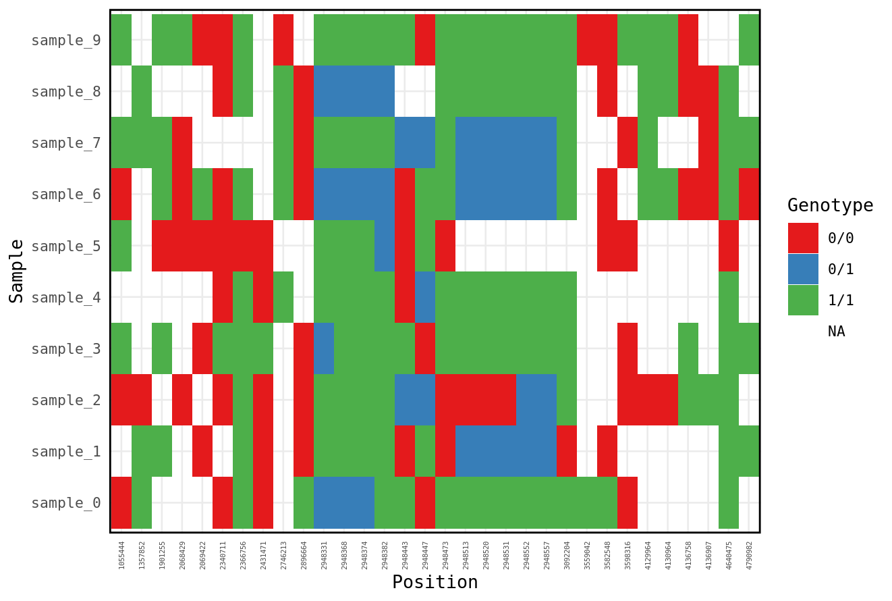

## Objectives

- To learn how to call variants using bcftools and freebayes.
- To read a VCF file.
- To filter a VCF file.
- To visualize a VCF file.

****

When we are resequencing a species with a reference genome, the ultimate goal is to 
detect where your new sample differs from the reference genome and how multiple
samples differ from each other. To do this, we are going to use the aligned sequence
data to call variants. 

First thing, log into the server and remember to source your bash.sh file so that you have access to the modules.

I've supplied you with aligned bam files and a reference genomes on the server at "/project/ctb-grego/sharing/lab_7". 

```bash
ls -R /project/ctb-grego/sharing/lab_7
```
```output
bam  reference

/project/ctb-grego/sharing/lab_7/bam:
sample_0.bam      sample_2.bam.bai  sample_5.bam      sample_7.bam.bai
sample_0.bam.bai  sample_3.bam      sample_5.bam.bai  sample_8.bam
sample_1.bam      sample_3.bam.bai  sample_6.bam      sample_8.bam.bai
sample_1.bam.bai  sample_4.bam      sample_6.bam.bai  sample_9.bam
sample_2.bam      sample_4.bam.bai  sample_7.bam      sample_9.bam.bai

/project/ctb-grego/sharing/lab_7/reference:
SalmonReference.fasta
```
We could copy those files into your home directory, but that would mean there will be a different
copy for every student. When files are very large or there are many users that can be a problem. 
Instead, we're going to create a symbolic link. This looks like a file on your system, and you can use it like a file,
but the orginal data stays in one spot and isn't copied. 

```bash
#Make a directory for the new bam file links to go
mkdir lab_7/bam
cd lab_7/bam

#Link all the bam files
ln -s /project/ctb-grego/sharing/lab_7/bam/* ./

#Take a look and see if it worked.
ls
```

```output
sample_0.bam      sample_2.bam.bai  sample_5.bam      sample_7.bam.bai
sample_0.bam.bai  sample_3.bam      sample_5.bam.bai  sample_8.bam
sample_1.bam      sample_3.bam.bai  sample_6.bam      sample_8.bam.bai
sample_1.bam.bai  sample_4.bam      sample_6.bam.bai  sample_9.bam
sample_2.bam      sample_4.bam.bai  sample_7.bam      sample_9.bam.bai
```

Now lets do the same for the reference genome
```bash
mkdir ../reference
cd ../reference
ln -s /project/ctb-grego/sharing/lab_7/reference/* ./
```

We're first going to use bcftools mpileup to call genotypes. We need to create a file that tells bcftools
where all the bam files are and what their names are. We can do that using shell commands.
```bash
cd ~/lab_7
ls bam | grep -v ".bai" | sed 's/^/bam\//g' > bamlist.txt
```
### Question
1. Break down the command used to create bamlist.txt and explain what step is doing.


Now we're going to call the first step, bcftools mpileup.

```bash
module load StdEnv/2023  gcc/12.3 bcftools/1.18

#We're using the -q 20 option here to require that reads have mapq >= 20.
bcftools mpileup -q 20 -f reference/SalmonReference.fasta -b bamlist.txt  > lab_7.g.vcf
```

The output of this is like a vcf file but it includes information on all sites in the genome,
but hasn't actually called genotypes yet. This is an intermediate file format before we create
the final vcf. Lets take a look.

```bash
less lab_7.g.vcf
```
```output
##FILTER=<ID=PASS,Description="All filters passed">
##bcftoolsVersion=1.18+htslib-1.18
##bcftoolsCommand=mpileup -q 20 -f reference/SalmonReference.fasta -b bamlist.txt
##reference=file://reference/SalmonReference.fasta
##contig=<ID=chr_1,length=5000000>
##contig=<ID=chr_2,length=5000000>
##ALT=<ID=*,Description="Represents allele(s) other than observed.">
##INFO=<ID=INDEL,Number=0,Type=Flag,Description="Indicates that the variant is an INDEL.">
##INFO=<ID=IDV,Number=1,Type=Integer,Description="Maximum number of raw reads supporting an indel">
##INFO=<ID=IMF,Number=1,Type=Float,Description="Maximum fraction of raw reads supporting an indel">
##INFO=<ID=DP,Number=1,Type=Integer,Description="Raw read depth">
##INFO=<ID=VDB,Number=1,Type=Float,Description="Variant Distance Bias for filtering splice-site artefacts in RNA-seq data (bigger is better)",Version="3">
##INFO=<ID=RPBZ,Number=1,Type=Float,Description="Mann-Whitney U-z test of Read Position Bias (closer to 0 is better)">
##INFO=<ID=MQBZ,Number=1,Type=Float,Description="Mann-Whitney U-z test of Mapping Quality Bias (closer to 0 is better)">
##INFO=<ID=BQBZ,Number=1,Type=Float,Description="Mann-Whitney U-z test of Base Quality Bias (closer to 0 is better)">
##INFO=<ID=MQSBZ,Number=1,Type=Float,Description="Mann-Whitney U-z test of Mapping Quality vs Strand Bias (closer to 0 is better)">
##INFO=<ID=SCBZ,Number=1,Type=Float,Description="Mann-Whitney U-z test of Soft-Clip Length Bias (closer to 0 is better)">
##INFO=<ID=SGB,Number=1,Type=Float,Description="Segregation based metric, http://samtools.github.io/bcftools/rd-SegBias.pdf">
##INFO=<ID=MQ0F,Number=1,Type=Float,Description="Fraction of MQ0 reads (smaller is better)">
##INFO=<ID=I16,Number=16,Type=Float,Description="Auxiliary tag used for calling, see description of bcf_callret1_t in bam2bcf.h">
##INFO=<ID=QS,Number=R,Type=Float,Description="Auxiliary tag used for calling">
##FORMAT=<ID=PL,Number=G,Type=Integer,Description="List of Phred-scaled genotype likelihoods">
#CHROM  POS     ID      REF     ALT     QUAL    FILTER  INFO    FORMAT  bam/sample_0.bam        bam/sample_1.bam        bam/sample_2.bam        bam/sample_3.bam        ba>
chr_1   1       .       T       <*>     0       .       DP=1;I16=1,0,0,0,33,1089,0,0,60,3600,0,0,0,0,0,0;QS=1,0;MQ0F=0  PL      0,0,0   0,0,0   0,0,0   0,3,33  0,0,0   0,>
chr_1   2       .       G       <*>     0       .       DP=1;I16=1,0,0,0,14,196,0,0,60,3600,0,0,1,1,0,0;QS=1,0;MQ0F=0   PL      0,0,0   0,0,0   0,0,0   0,3,14  0,0,0   0,>
chr_1   3       .       G       <*>     0       .       DP=1;I16=1,0,0,0,33,1089,0,0,60,3600,0,0,2,4,0,0;QS=1,0;MQ0F=0  PL      0,0,0   0,0,0   0,0,0   0,3,33  0,0,0   0,>
chr_1   4       .       G       <*>     0       .       DP=1;I16=1,0,0,0,33,1089,0,0,60,3600,0,0,3,9,0,0;QS=1,0;MQ0F=0  PL      0,0,0   0,0,0   0,0,0   0,3,33  0,0,0   0,>
chr_1   5       .       C       <*>     0       .       DP=1;I16=1,0,0,0,33,1089,0,0,60,3600,0,0,4,16,0,0;QS=1,0;MQ0F=0 PL      0,0,0   0,0,0   0,0,0   0,3,33  0,0,0   0,>
chr_1   6       .       A       <*>     0       .       DP=1;I16=1,0,0,0,37,1369,0,0,60,3600,0,0,5,25,0,0;QS=1,0;MQ0F=0 PL      0,0,0   0,0,0   0,0,0   0,3,37  0,0,0   0,>
chr_1   7       .       A       <*>     0       .       DP=1;I16=1,0,0,0,37,1369,0,0,60,3600,0,0,6,36,0,0;QS=1,0;MQ0F=0 PL      0,0,0   0,0,0   0,0,0   0,3,37  0,0,0   0,>
chr_1   8       .       G       <*>     0       .       DP=1;I16=1,0,0,0,37,1369,0,0,60,3600,0,0,7,49,0,0;QS=1,0;MQ0F=0 PL      0,0,0   0,0,0   0,0,0   0,3,37  0,0,0   0,>
chr_1   9       .       G       <*>     0       .       DP=1;I16=1,0,0,0,37,1369,0,0,60,3600,0,0,8,64,0,0;QS=1,0;MQ0F=0 PL      0,0,0   0,0,0   0,0,0   0,3,37  0,0,0   0,>
chr_1   10      .       C       <*>     0       .       DP=1;I16=1,0,0,0,37,1369,0,0,60,3600,0,0,9,81,0,0;QS=1,0;MQ0F=0 PL      0,0,0   0,0,0   0,0,0   0,3,37  0,0,0   0,>
```

The file has a header denotated by the ## at the start of each line. This tells you what the abbreviations
used in the file mean. Then there's the line that starts with #CHROM, which is the column names for the rest
of the file. We have 9 information columns and then 1 column per sample. Each row after that is for a single
position in the genome. The most important parts of this file are:
- The first column, which is the chromosome.
- The second column, which is the position on that chromosome.
- The fourth column, which is the reference allele (i.e. the allele in the reference genome).
- The fifth column, which is the alternate allele(s). A possible deletion of this base is labelled as <*>. 
- The DP value in the info column. This tells you hany reads there is total for this site.
- The 10th column onward shows the genotype likelihoods for each sample. The three values, separated
by ",", are the phred scaled likelihoods for 0/0, 0/1 and 1/1 respectively. A 0 phred scaled likelihood,
is the most likely. Higher values are less likely. Ultimately, the program is going to pick a single
genotype value based on comparing these likelihoods. If there are more than one alternate allele, 
then there will be more possible genotype likelihoods. 

You'll notice that in the row that includes sample names, the names is the bam file including it's directory. 
This is not great, since it contains extra information and we'd really just want to include only
the actual name of the sample, not in it's bam file name. The way to do this is to add a "read group"
sample to the bam file. 

```bash
module load picard/3.1.0

java -jar $EBROOTPICARD/picard.jar AddOrReplaceReadGroups \
  I=bam/sample_0.bam \
  O=bam/sample_0.rg.bam \
  RGSM=sample_0 \
  RGLB=sample_0 \
  RGPL=Illumina \
  RGPU=NULL
```

## Questions
1. We've added read group to one sample. Make a shell script that adds the read group information to all samples, and additionally 
indexes the resulting bam file. Run your script.
2. RGSM is the readgroup sample information. Using the internet, figure out what information RGLB, RGPL and RGPU store.
3. The read group information is being added to the bam file. Take a look at your new .rg.bam file, and compare it to the original bam
to figure out where the readgroup information is stored. Hint: You need to use samtools -h to see the header. 
4. We want to run bcftools mpileup on our new set of bam files with readgroup info added. Make a new bamlist.txt file that has
those files and name it bamlist.rg.vcf.

Make sure you complete the four questions above before continuing. 

Lets remake our gvcf file, with the new readgroup added bams
```bash
bcftools mpileup -q 20 -f reference/SalmonReference.fasta -b bamlist.rg.txt  > lab_7.g.vcf

```
If we take a look at the resulting file, we can see that our samples are now correctly named.
The next step is to use this gvcf to call genotypes and create a vcf file. 

```bash
#We use the -m tag to allow for multiple alternate alleles when variant calling.
#We use the -v tag to only print variable sites.
#We use 'bcftools +fill-tags' to fill in some extra information about our variants (not necessary).
bcftools call -mv lab_7.g.vcf | bcftools +fill-tags> lab_7.bcftools.vcf
```

Now with this new vcf file we can see that it only includes a subset of sites in the genome. It doesn't
print out sites where there isn't a SNP or an INDEL. Take a look at the file and I'll highlight a few 
important points here:
- AC tag is the alternate count, which tells you how many alternate alleles have been called. Remember that 
in most cases your samples are diploid, so there for 10 samples, there are 20 allele calls.
- AN tag is the number of alleles called total. It is twice the number of genotyped samples at that site.
- AF tag is the alternate allele frequency.

The genotype field looks something like this "1/1:200,24,0". The first part is your genotype call. 
0 is the reference allele, 1 is the first alternate allele, 2 is the second alternate allele, etc. A
./. means that it isn't called since there was not enough reads to know. After the genotype is the phred 
scaled likelihood of each genotype (like in the gvcf). In other variant calling programs, there can
be other information here like read depth.

If we look at this vcf file, you may notice that many sites have an AF of 1, meaning that
all the samples have the alternate allele. This is partially an artifact of how the data was 
simulated, but in any case you will find allele like this in any dataset. Since these
sites are monomorphic within our dataset, they're not particularly useful. A common way of 
filtering a vcf is using a minor allele frequency cut off. 

```bash
bcftools view -q 0.1:minor lab_7.bcftools.vcf > lab_7.bcftools.maf10.vcf
```
Now that we've created our bcftools vcf, lets go back and delete the gvcf file
because it's fairly big and have limited space on the server.
```bash
rm lab_7.g.vcf
```

If we wanted to create the bcftools vcf again, we can actually pipe the two
bcftool commands together without saving the gvcf.
```
#Example, you don't need to run this
#bcftools mpileup -q 20 -d 200 -f Sockeye/ReferenceGenome/SalmonReference.fasta -b bamlist.rg.txt | bcftools call -mv > Biol470.bcftools.vcf
```

*** 

Another program for calling variants is freebayes (https://github.com/freebayes/freebayes). 
This program uses haplotypes (i.e. multiple bases together) instead of individual sites. 
It is a bit more complicated than bcftools but does better when there are more complicated 
changes like INDELS, which occurs in real data. 

Side Note: The most common program for variant calling 
is GATK, which is a spiritual successor for freebayes but has grown into a huge set of programs.
If you use human data, GATK is awesome, but if you're working on other organisms the quirks of GATK
are sometimes not worth the effort to make it work. 

```bash
module load StdEnv/2020 freebayes/1.3.6
#This will take a couple minutes. 
freebayes -L bamlist.rg.txt -f reference/SalmonReference.fasta > lab_7.fb.vcf
```

The first thing we will notice is that the freebayes vcf is larger than the bcftools vcf. 

```bash
ls -thor
```
```output
drwxr-x---. 2 grego   68 Feb 25 15:18 reference
drwxr-x---. 2 grego 4.0K Feb 25 16:27 bam
-rw-r-----. 1 grego  200 Feb 25 16:32 bamlist.txt
-rw-r-----. 1 grego 1.3M Feb 25 16:36 Biol470.vcf
-rw-r-----. 1 grego 8.3M Feb 25 16:39 lab_7.bcftools.vcf
-rw-r-----. 1 grego  44K Feb 25 16:50 lab_7.bcftools.maf10.vcf
-rw-r-----. 1 grego  274 Feb 25 17:02 add_rg.sh
-rw-r-----. 1 grego  17M Feb 25 17:18 lab_7.fb.vcf
```

## Question:
1. How many variants were identified with bcftools? How many with Freebayes?

If we take a look at the two files, we can see that they do actually overlap but
freebayes tends to have a lot more SNPs. This is a general property of freebayes, it
is very lenient in what it thinks might be a variant. For example, the first SNP in 
bcftools is at 73673 bases, but freebayes thinks there might actually be a bunch before that.
Since this is simulated data we know the truth, which is that there are no variants before 73673 (
just based on how I set it up). 

The key column to note here is the QUAL column (Column #6). This is the phred scaled likelihood
that there really is a variant here in any of the samples. Larger values mean it is very very unlikely
that this variant is produced by base call errors in the sequencer. We can see that for the early SNPs in 
freebayes they all have very low QUAL score. When using Freebayes, you should require at least a minimum 
QUAL score of 20 to look at a SNP. 

```bash
bcftools view -i 'QUAL > 20' -q 0.1:minor lab_7.fb.vcf > lab_7.fb.Q20.vcf
```

You should note that QUAL is a minimum filter, and doesn't guarantee that your genotypes are correct
or that this is a real SNP. You can often have SNPs generated from misalignment of paralogs or 
repetitive regions. When working with complicated genomes like plants, it's regular to remove more than 50% of SNPs
during filtering. QUAL scores scale with minor allele frequency, since at a higher minor allele frequency there
must be more reads with the alternate base. To get high quality calls, it's important to look at some
of the other stats and to remove outliers. 

In the last part of this tutorial, we're going to visualize our vcf directly using R. This
lets us see overall patterns in missing data or genotypes and can spot problems that you won't
notice otherwise. 

Open the Rstudio Server instance (https://indri.rcs.uvic.ca).

```R
install.packages("vcfR")
library(tidyr)
library(dplyr)
library(vcfR)
library(ggplot2)

```

We're going to the vcfR package to convert our vcf file, into a tidy format for easy manipulation
in R.

```R
vcf_file <- "/home/grego/lab_7/lab_7.fb.Q20.vcf"
vcf <- read.vcfR(vcf_file)
#extract the genotypes
gt_data <- vcfR2tidy(vcf, format_fields = 'GT' )
gt = gt_data$gt
names(gt) = c('Chr','Position','ID','Genotype','Allele')
gt
```
```output
# A tibble: 620 × 5
     Chr Position ID       Genotype Allele
   <int>    <int> <chr>    <chr>    <chr> 
 1     1  1055444 sample_8 NA       .     
 2     1  1357852 sample_8 1/1      A/A   
 3     1  1901255 sample_8 NA       .     
 4     1  2068429 sample_8 NA       .     
 5     1  2069422 sample_8 NA       .     
 6     1  2340711 sample_8 0/0      T/T   
 7     1  2366756 sample_8 1/1      G/G   
 8     1  2431471 sample_8 NA       .     
 9     1  2746213 sample_8 1/1      C/C   
10     1  2896664 sample_8 0/0      C/C   
# ℹ 610 more rows
# ℹ Use `print(n = ...)` to see more rows
```

We now have a dataframe where each row is a single genotype for a single individual.
This gives us a lot of flexibility to plot or manipulate the data using the tidyverse
skills we learned early in the course. Here are a couple examples. First lets just plot 
all the genotypes

```R
gt %>% 
  filter(Chr == 1) %>%
  ggplot(aes(y = ID, x = as.factor(Position), fill = Genotype)) +
  geom_tile() +
  xlab("Individuals") +
  scale_fill_brewer("Genotype",palette = "Set1") +
  theme_minimal(base_size=10) + ylab('Sample')+xlab('Position') +
  theme(axis.text.x = element_text(size=4,angle = 90, vjust = 0.5, hjust = 1),
        panel.border = element_rect(colour = "black", fill=NA, size=1),
        strip.text.y.right = element_text(angle = 0))
```


This could show us if there are some samples with more missing data. 

We could also query that directly by calculating the proportion of missing
genotypes by sample.

```R
gt %>%
  group_by(ID) %>%
  mutate(missing = case_when(is.na(Genotype) ~ "Yes",
                             TRUE ~ "No")) %>%
  group_by(ID, missing) %>%
  summarise(n = n()) %>%
  mutate(freq = n / sum(n)) %>%
  filter(missing == "Yes")
```
While there are tools to do tasks like this (e.g. vcftools), being able
to code them yourself in R gives you flexibility to customize each analyses to your
particular requirements. 


