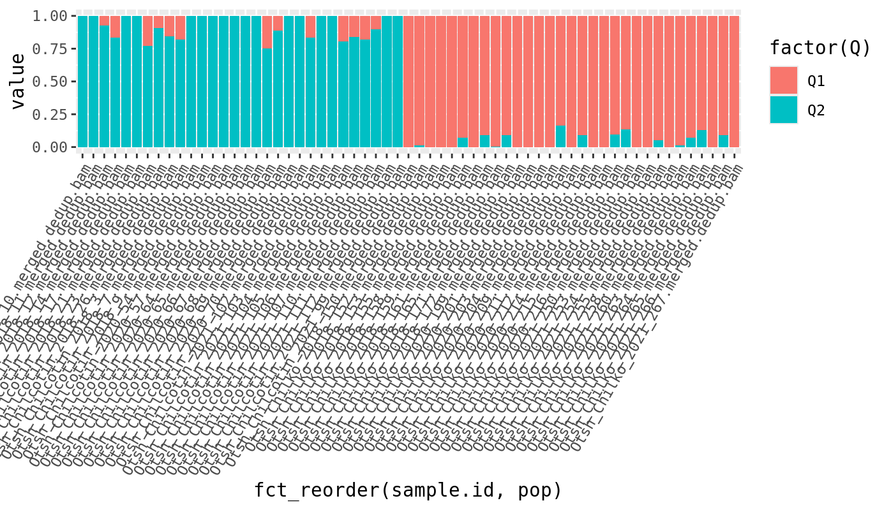
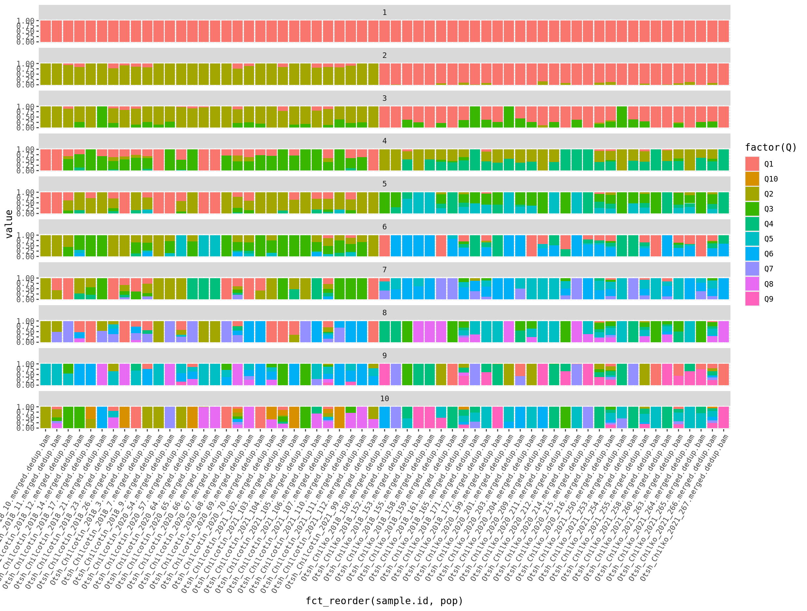
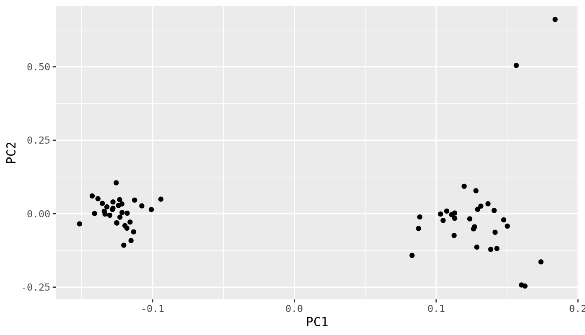
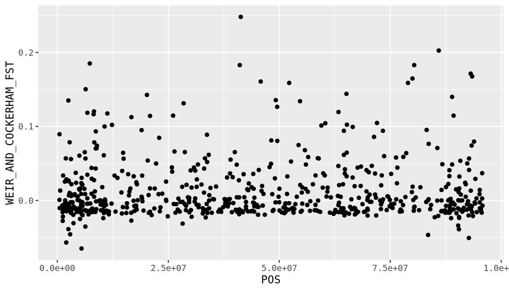
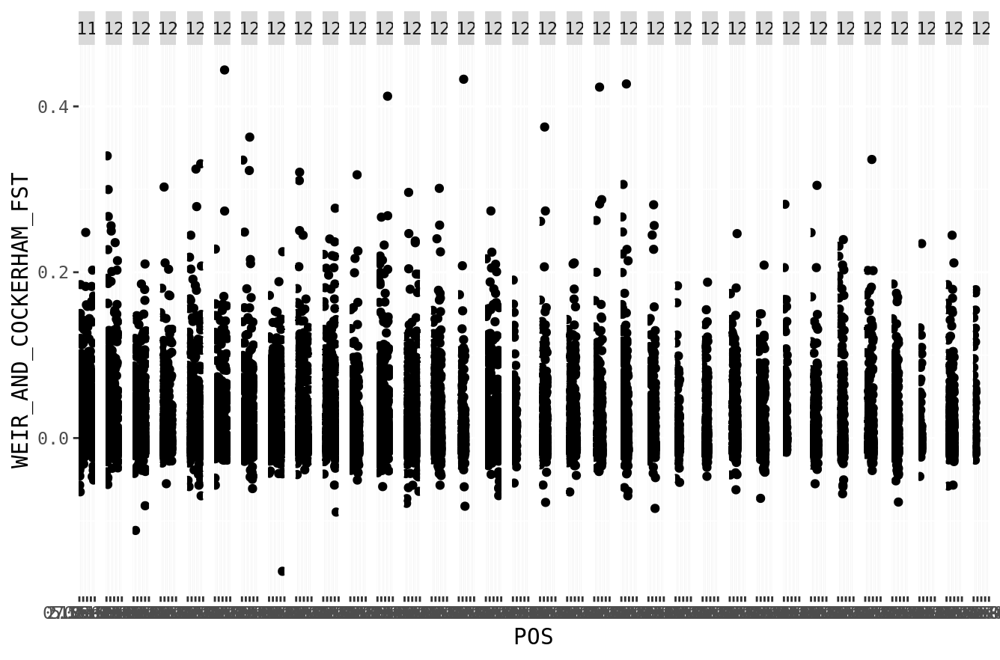
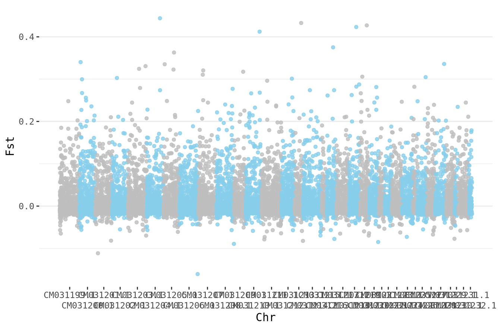

## Objectives

- To run a population structure analysis
- To run a PCA on a vcf file.
- To visualize the results of a PCA and population structure
- To calculate FST on a vcf file.
- To plot FST across a genome.


****

Today we're going to explore how to measure relatedness or genetic similarity between samples
using a vcf file. Log into the fossa server and remember to source your bash.sh file 
so that you can access the module system. First we're going to make some directories and
copy in an example vcf file. 

```bash
cd /project/biol470-grego/YOUR_NAME
mkdir lab_8
cd lab_8
mkdir vcf
cp /project/ctb-grego/sharing/lab_8/chinook.g5.m2.c5.d5.20miss.subsample.vcf.gz vcf/
```

This contains a thinned set of SNPs for some Chinook salmon. 

## Question
- How many samples are in the vcf file? How many SNPs?
- Extract a list of the sample names in the file. The list should have one sample name per line.  
HINT: Sample names are in the header line starting with #CHROM. 
HINT: You can convert tabs to newlines using the 'tr' command.
HINT: Alternate idea is to use bcftools query

We want to group these samples into populations, so we're going to use the program "admixture".
This program takes a set of genotypes and attempts to put samples into "groups" or "populations". 
When running it, you choose the number of populations (designated as K in the program), and
it assigns individual samples to each population. It can also assign samples to multiple populations.
For example, one sample could be 50% population 1 and 50% population 2. This means that this 
sample looks like it is genetically a mix of the two populations. 

To decide on the correct number of populations to divide your data into, admixture uses 
cross-validation. This is a stastitical technique that repeatedly builds a model with some 
of the data and then tests it with the rest. If the test data fits the model well, then 
it suggests the assumptions (i.e. the number of populations) are probably correct. There
are other programs that do a function similar to admixture (i.e. STRUCTURE, fast-structure)
that estimate populations in different ways, but are fundamentally trying to achieve the same thing. 


To use admixture, we need to have our data in "bed" format. Bed is the binary version of ped format,
which basically organizes the data into a table with genotype calls. Bed format also has
accessory files "fam" and "bim" which have information about family structure and SNP identity.
We're going to plink to convert the vcf to bed. Plink is a very large set of tools that do many
tasks in population genetics, although it's largely designed for humans. This means it expects
human chromosome labels, and you have to specify when its not. 

```bash
module load plink
plink --vcf chinook.g5.m2.c5.d5.20miss.subsample.vcf.gz \
  --out chinook.g5.m2.c5.d5.20miss.subsample \
  --make-bed \
  --allow-extra-chr \
  --double-id
ls
```
The options for this include:
"--out" which specifies the prefix of the outfile.
"--make-bed" which tells it to make a bed file output.
"--allow-extra-chr" which allows us to use non-human chromosome names.
"--double-id" which prevents it from interpreting the "_" in the file name as indicating familial relationships.

Take a look at the files its made, you should see a bed, fam, log, nosex and bim file.
The next step is to run admixture. We have to give it our bed file and also a k value.
The k value is the number of groups that admixture will try to place our individuals into. 
We can start with k=1, as a baseline.

```bash
module load admixture
admixture chinook.g5.m2.c5.d5.20miss.subsample.bed 1
```

```output
[grego@indri vcf]$ admixture chinook.g5.m2.c5.d5.20miss.subsample.bed 1
****                   ADMIXTURE Version 1.3.0                  ****
****                    Copyright 2008-2015                     ****
****           David Alexander, Suyash Shringarpure,            ****
****                John  Novembre, Ken Lange                   ****
****                                                            ****
****                 Please cite our paper!                     ****
****   Information at www.genetics.ucla.edu/software/admixture  ****

Random seed: 43
Point estimation method: Block relaxation algorithm
Convergence acceleration algorithm: QuasiNewton, 3 secant conditions
Point estimation will terminate when objective function delta < 0.0001
Estimation of standard errors disabled; will compute point estimates only.
Invalid chromosome code!  Use integers.
```
Uh oh, invalid chromosome code? This is another relic of programs being design for
human data. It expects that the chromosome names should be "1" instead of an arbitrary
series of letters, which is what ours are. The solution to this is to rename our chromosomes to 
numbers. We can do this using 'bcftools annotate' but I've written a small perl script to do it 
slightly easier. 

```bash
zcat chinook.g5.m2.c5.d5.20miss.subsample.vcf.gz | \
  perl /project/ctb-grego/sharing/vcf2numericchrs.pl \
  chinook.g5.m2.c5.d5.20miss.subsample.keyfile.txt > chinook.g5.m2.c5.d5.20miss.subsample.nchrs.vcf
```
Now we've created a new vcf, where each chromososome is a number, and 
a keyfile for later if we want to convert them back into the original names 
(chinook.g5.m2.c5.d5.20miss.subsample.keyfile.txt). Lets repeat the same plink steps and
try admixture again.

```bash
plink --vcf chinook.g5.m2.c5.d5.20miss.subsample.nchrs.vcf \
  --out chinook.g5.m2.c5.d5.20miss.subsample.nchrs \
  --make-bed \
  --allow-extra-chr \
  --double-id \
  --autosome-num 95
```
You can see, we've added an extra flag here "--autosome-num 95". Now that we have
converted the chromosomes to numbers, it expects that there should be a max of 26. 
We're putting in 95 here, not because salmon have 95 chromosomes, but because its the max value
and we just want it to process this without giving more complaints. Since we're just converting
the file, it doesn't really matter how many chromosomes there are.

```bash
admixture chinook.g5.m2.c5.d5.20miss.subsample.nchrs.bed 1
```
```output
****                   ADMIXTURE Version 1.3.0                  ****
****                    Copyright 2008-2015                     ****
****           David Alexander, Suyash Shringarpure,            ****
****                John  Novembre, Ken Lange                   ****
****                                                            ****
****                 Please cite our paper!                     ****
****   Information at www.genetics.ucla.edu/software/admixture  ****

Random seed: 43
Point estimation method: Block relaxation algorithm
Convergence acceleration algorithm: QuasiNewton, 3 secant conditions
Point estimation will terminate when objective function delta < 0.0001
Estimation of standard errors disabled; will compute point estimates only.
Size of G: 61x14346
Performing five EM steps to prime main algorithm
1 (EM)  Elapsed: 0.015  Loglikelihood: -712273  (delta): 930843
2 (EM)  Elapsed: 0.015  Loglikelihood: -712273  (delta): 0
3 (EM)  Elapsed: 0.015  Loglikelihood: -712273  (delta): 0
4 (EM)  Elapsed: 0.015  Loglikelihood: -712273  (delta): 0
5 (EM)  Elapsed: 0.015  Loglikelihood: -712273  (delta): 0
Initial loglikelihood: -712273
Starting main algorithm
1 (QN/Block)    Elapsed: 0.052  Loglikelihood: -712273  (delta): 0
Summary:
Converged in 1 iterations (0.184 sec)
Loglikelihood: -712272.711731
Writing output files.
````

It has now produced two output files: chinook.g5.m2.c5.d5.20miss.subsample.nchrs.1.Q and 
chinook.g5.m2.c5.d5.20miss.subsample.nchrs.1.P. The Q file includes the ancestry of each
sample for each group. In this case, there's only one group, but this will be more useful with
higher K values. The P file estimates allele frequencies for each SNP in each population, which 
isn't useful for us now. 

Ultimately for this type of algorithm, we want to try multiple K values and find which one is best. To
do that we use a cross-validation method. In this method, they mask some genotype values, and try
to predict what they are, based on the groupings. Lower cross-validation error means the model
is a better fit. Lets run this for K from 1 to 10. 

```bash
for K in `seq 10`
  do
  admixture --cv chinook.g5.m2.c5.d5.20miss.subsample.nchrs.bed $K -j3 | tee log${K}.out;
done
```
The "tee" command is allowing us to save the output that is output to the screen into a file. 
We need those files to compare the CV error for each. Lets look at all the CV error scores.

```bash
grep -h CV log*.out
```

```output
CV error (K=10): 1.00561
CV error (K=1): 0.46015
CV error (K=2): 0.47496
CV error (K=3): 0.53477
CV error (K=4): 0.60377
CV error (K=5): 0.66514
CV error (K=6): 0.72932
CV error (K=7): 0.79938
CV error (K=8): 0.86884
CV error (K=9): 0.94260
```

From this we can see that the lowest CV is with with K=1, and K=2 is only slightly worse. This
suggests that there isn't much population grouping in our dataset. It's always good to look at
how your groups are distributed amongst your samples and see if it makes sense biologically. To
do that, we have plot the Q values for each K. We're going to use R for this. Download the files 
you created from admixture using scp.  

```R
install.packages('tidyverse')
library(ggplot2)
library(dplyr)
library(readr)
library(tidyr)
library(forcats)


#Get sample names in order from the .fam 
#Make sure you use the correct path for where you have downloaded your files.
sample_names <- read_table("chinook.g5.m2.c5.d5.20miss.subsample.nchrs.fam",col_names = F) %>%
  select(X1) %>%
  rename(sample.id=X1)
all_data <- tibble()

#Loop for each K value
for (k in 1:10){
  #Read the Q file 
  data <- read_delim(paste0("chinook.g5.m2.c5.d5.20miss.subsample.nchrs.",k,".Q"),
                     col_names = paste0("Q",seq(1:k)),
                     delim=" ")
  #Add in sample names
  data$sample.id <- sample_names$sample.id
  #Add in the K value
  data$k <- k
  
  #Convert the wide table to a long table, which is easier to plot
  data %>% gather(Q, value, -sample.id,-k) -> data
  #Bind together all the outputs of each K value
  all_data <- rbind(all_data,data)
}
```
Before we do the plotting, lets get some information about the samples. Thankfully,
all the information is in the sample name. e.g. Otsh_Chilcotin_2018_10.merged.dedup.bam.
- Otsh <- species abbreviation
- Chilcotin <- population
- 2018 <- sampling year
- 10 <- sample number

We probably will want to plot by year and population, so lets extract that into our table.

```R
all_data <- all_data %>%
  separate(sample.id, c("species","pop","year","spacer"), "_", remove=F ) %>%
  separate(spacer, c("sample_n"),remove=T)
```
And now, lets plot for K=2
```R
all_data %>%
  filter(k == 2) %>%
  ggplot(.,aes(x=fct_reorder(sample.id,pop),y=value,fill=factor(Q))) + 
  geom_bar(stat="identity",position="stack") +
  theme(axis.text.x = element_text(angle = 60, hjust = 1))
```


This looks interesting! We're sorting the x axis by the population label, so 
samples are ordered by population. We can see that the first half samples are mostly group 1
and the second half are mostly group 2. This is evidence that those populations reflect
actual genetically separated populations because admixture is rediscovering the groupings,
without being given the labels. We can also explore what the groupings look like at higher levels
of K.


## Questions
- Make a nice version of the plot for K=2. Update the axis labels, colors, theme, title and sample names.
- Make a version of the plot with K=2, where samples are ordered by their ancestry proportion. Hint: Try fct_reorder()
- Try running admixture with K=10 again and see if you get identical scores. What does this mean?

Next, lets do a PCA on the samples to see how they are related. 
Principal Component Analysis (PCA) is a statistical technique used to visualize genetic relationships among samples by reducing the dimensionality of genetic data. It transforms the original variables (i.e. genotype counts) into a new set of uncorrelated variables called principal components, which capture the maximum variance in the data. The first few principal components typically explain most of the variation, allowing researchers to plot the samples in a two-dimensional or three-dimensional space. In the context of population genetics, PCA helps to identify patterns of genetic similarity and differentiation among individuals, revealing clusters that may correspond to distinct populations or subpopulations.
We're going to use plink for this, so go back into the terminal.

```bash
plink --vcf chinook.g5.m2.c5.d5.20miss.subsample.nchrs.vcf --out chinook.g5.m2.c5.d5.20miss.subsample.nchrs --pca --allow-extra-chr --double-id --autosome-num 95
```
This outputs a .eigenvec and a .eigenval file. The .eigenvec file has the scores for the
first 20 Principal Components, which we want to plot. We have to load this
into R to plot it. Again, use scp to download the files you just created. 

```R
pca_data <- read_table("chinook.g5.m2.c5.d5.20miss.subsample.nchrs.eigenvec",
         col_names = c("sample.id","spacer",paste0("PC",1:20)))
```
In this case, the data file does not have a header, so we have to tell it what the columns are named.
The command "paste0("PC",1:20)", makes the names PC1, PC2 ... PC20. 

Now we want to make a scatter plot of these scores.
```R
pca_data %>%
  ggplot(.,aes(x=PC1,y=PC2)) +
  geom_point()
```


## Questions
- Make a version of this plot with population as point color and year as point shape.
- Add ellipses around the population groups to show their range of values. This can be done directly by ggplot. 

Lastly, we want to calculate FST between our populations. FST is a measure of genetic differentiation. 
Two populations with FST=0 means that they have the same allele frequencies. FST=1 means that they are fixed
for different alleles. Higher values means that populations are more different. You can calculate
FST for each site in your vcf, or it can be calculated as a single value for all sites. 

We're going to use vcftools to calculate FST. Go back to the terminal.

```bash
#First make a list of all your samples
bcftools query -l chinook.g5.m2.c5.d5.20miss.subsample.vcf.gz > chinook.g5.m2.c5.d5.20miss.subsample.samplenames.txt

#Next we need to get a list of samples for each population, Chilko and Chilcotin. We can use grep to get that.
bcftools query -l chinook.g5.m2.c5.d5.20miss.subsample.vcf.gz | grep Chilko > chilko.txt
bcftools query -l chinook.g5.m2.c5.d5.20miss.subsample.vcf.gz | grep Chilcotin > chilcotin.txt
#This only worked because we had our populations in the sample name, which is a why its useful to have that.
```
Now we next calculate Weir and Cockerhams FST from our vcf
```bash
vcftools --gzvcf chinook.g5.m2.c5.d5.20miss.subsample.vcf.gz \
--weir-fst-pop chilko.txt \
--weir-fst-pop chilcotin.txt \
--out chinook.g5.m2.c5.d5.20miss.subsample
```
This gives us a per-site FST value. Its important to note here that to get the average FST
across the entire genome, we can't just average these scores. The correct way is to 
sum the numerator and denominator of FST (which vcftools doesn't report). You'll
need to use a different program (like hierfstat) to get that.

Anyway, we should visualize this data across the genome using a manhattan plot. Lets go back to R. 
Again, download your output using scp. 
```R
fst <- read_tsv("lab_8/vcf/chinook.g5.m2.c5.d5.20miss.subsample.weir.fst")
fst %>%
  filter(CHROM == "CM031199.1") %>%
  ggplot(.,aes(x=POS,y=WEIR_AND_COCKERHAM_FST)) +
  geom_point()
```


That looks pretty good, but what if we wanted to put all of the chromosomes in one figure? We
can try using facet_wrap() to facet by chromosome.
```R
fst %>%
  ggplot(.,aes(x=POS,y=WEIR_AND_COCKERHAM_FST)) +
  geom_point() +
  facet_wrap(~CHROM, nrow=1)
```


That works, but is not great. It has a fair amount of wasted space between the facets. Ideally,
we'd want to have all of the SNPs in one long axis representing the cumulative genome. We
can do this! This script converts all the chromosome positions, into one long chromosome (for the purposes of plotting). 
For example, if chromosome 1 ends at position 100,000, then chromosome 2 will start at position 100,001. We can then plot
the entire genome as one big chromosome, and use color to show where one chromosome ends and the other starts. 

```R
#We need to create a table with the length of each chromosome.
chr_lengths <- fst %>%
  group_by(CHROM) %>%
  summarize(length=max(POS))

#Make cumulative
chr_lengths %>%
  # Calculate cumulative position of each chromosome
  mutate(total=cumsum(length)-length) %>%
  # Remove the length column, we don't need it anymore.
  select(-length) %>%
  # Add this info to the initial dataset
  left_join(fst, ., by=c("CHROM"="CHROM")) %>%
  # Make sure that positions are still sorted
  arrange(CHROM, POS) %>%
  # Now create a new column with the cumulative position
  mutate( cumulative_pos=POS+total) -> fst.cumulative

#This is used to find the middle position of each chromosome for labelling
axisdf <- fst.cumulative %>% 
  group_by(CHROM) %>% 
  summarize(center=( max(cumulative_pos) + min(cumulative_pos) ) / 2 )
```
With this, we can then make a single plot that includes the entire genome.
```R
fst.cumulative %>%
  ggplot(.) +
  geom_point( aes(x=cumulative_pos, y=WEIR_AND_COCKERHAM_FST,color=as.factor(CHROM)), 
              alpha=0.8, size=1.3) +
  # Alternate chromosome point colors
  scale_color_manual(values = rep(c("grey", "skyblue"), nrow(chr_lengths) )) +
  # Custom X-axis
  scale_x_continuous( label = axisdf$CHROM, breaks= axisdf$center, 
                      guide = guide_axis(n.dodge=2)) +
  theme_bw() +
  theme(legend.position="none",
        panel.border = element_blank(),
        panel.grid.major.x = element_blank(),
        panel.grid.minor.x = element_blank()) +
  xlab("Chr") +
  ylab("Fst")
```


Hurray. We've learned how to do population genetic analyses with SNPs!


