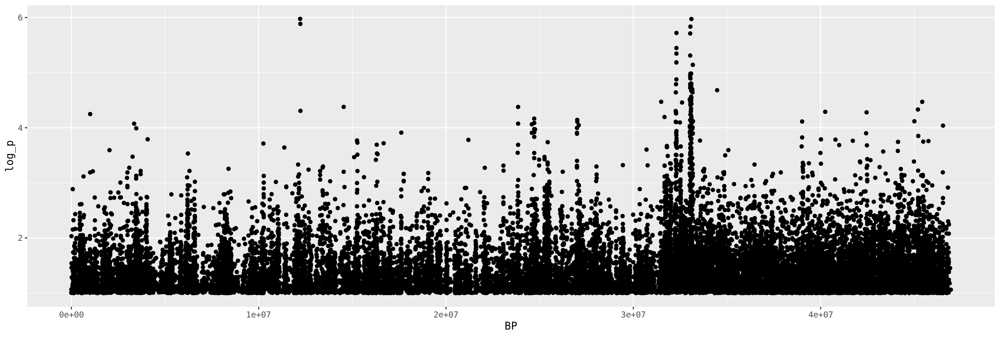

## Objectives

- To format data for a GWA analysis
- To run a GWA
- To plot a GWA analysis
- To run a single association test manually

****

In today's lab we're going to run a genome-wide association
on some example data. Login to the server and remember to source
your bash.sh to have access to the module system. 

First we're going to organize our directory and create a symbolic link
with the data file.
```shell
cd ~
mkdir lab_9
mkdir lab_9/vcf
mkdir lab_9/pca
mkdir lab_9/gwas
mkdir lab_9/info
cd lab_9
ln -s /project/ctb-grego/sharing/lab_9/chinook.gwas.vcf.gz vcf/
```
We've created a series of different directories where we can put our different
files to keep everything organized. Moving forward, remember to put data files and output
in the correct location. Organization is very important because for many projects,
you're going to be working on them for perhaps years and you will forget where you
put individual items. 

As a first step, we're going to run a PCA on our samples.

```shell
module load plink
plink --vcf vcf/chinook.gwas.vcf.gz --out pca/chinook.gwas --pca --allow-extra-chr --double-id --autosome-num 95
```

Lets take a look at this to make sure none of the samples are behaving badly. For example, if we accidentally had a sample of the wrong species, when we look at this PCA then it will be very far from all the other samples. Open Rstudio server.

```R

library(ggplot2)
library(dplyr)
library(readr)
library(tidyr)
library(forcats)

pca_data <- read_table("lab_9/pca/chinook.gwas.eigenvec",
                       col_names = c("family.id","sample.id",paste0("PC",1:20)))

pca_data %>%
  ggplot(.,aes(x=PC1, y=PC2)) + 
  geom_point()
```


### Question
- Based on the sample names, color code the PCA plot by year. 
Are the two years different in the first two PCs? What about PCs 3 and 4?

We want to use the PCA values as covariates for our GWA. We're going to use
plink for the GWA so we have to follow its format. It wants the first two columns to
contain the family ID and sample ID. If you had related individuals, you could use this
to show which family each was in, but in our case each individual is a random fish
and we don't expect any to be close relatives. So for each sample we're using the same
value for family ID and sample ID. 

```R
pca_data %>%
  select(family.id, sample.id, PC1, PC2, PC3, PC4, PC5) %>%
  write_tsv("lab_9/info/chinook.gwas.pca.txt")

```
The phenotype file I've included in the shared directory, so we can copy that over
```shell
cp /project/ctb-grego/sharing/lab_9/chinook.date.pheno info/chinook.gwas.pheno.txt
```

Now we're ready to run our first GWAS. 
```shell
plink --vcf vcf/chinook.gwas.vcf.gz \
    --out gwas/chinook.gwas \
    --linear \
    --covar info/chinook.gwas.pca.txt \
    --allow-extra-chr \
    --double-id \
    --pheno info/chinook.gwas.pheno.txt \
    --all-pheno \
    --allow-no-sex
```
With this command, we're using a linear model to test the association between this trait
and the genotype (since its a quantitative trait). We're using the first 5 PCs as covariates
to control for population stratification. We're passing the phenotype values in a separate file
with the --pheno option. 

Now lets plot this in R.
```R
gwas <- read_table("lab_9/gwas/chinook.gwas.P1.assoc.linear")
head(gwas)
```
```output
> head(gwas)
# A tibble: 6 × 10
  CHR        SNP      BP A1    TEST  NMISS     BETA    STAT        P X10  
  <chr>      <chr> <dbl> <chr> <chr> <dbl>    <dbl>   <dbl>    <dbl> <chr>
1 CM031216.1 .       455 T     ADD      95   -3.09  -1.67   9.79e- 2 NA   
2 CM031216.1 .       455 T     COV1     95   40.9    2.86   5.25e- 3 NA   
3 CM031216.1 .       455 T     COV2     95 -112     -7.34   9.92e-11 NA   
4 CM031216.1 .       455 T     COV3     95   46.6    3.34   1.24e- 3 NA   
5 CM031216.1 .       455 T     COV4     95    0.534  0.0378 9.70e- 1 NA   
6 CM031216.1 .       455 T     COV5     95   20.8    1.40   1.64e- 1 NA   
```
For each SNP in the genome, we have multiple lines. One of the lines is the association between the SNP and our phenotype (after controlling for covariates), while the others are the
effect of the covariate on the SNP. We aren't particularly interested in the covariate
effects, so we can filter those out. 
```R
gwas <- gwas %>%
  filter(TEST == "ADD")
```
Lastly, when plotting GWAS, its easier to visualize -log10(p) values, so lets create that column.
```R
gwas <- gwas %>%
  mutate(log_p = -log10(P))
```
When making GWA plots, we often have huge numbers of points. If you try to make a figure
with millions of points, it often bogs down you computer or results in a pdf file that
is way too big to handle. So, an easy work around is to filter points to not plot
SNPs that are completely unassociated. 
```R
gwas %>%
  filter(log_p > 1) %>%
  ggplot(.,aes(x=BP,y=log_p)) +
  geom_point()
```


We see a pretty big peak at the right side of the graph, as well as a
couple high points midway across the chromosome. Lets zoom in on these.

```R
gwas %>%
  arrange(desc(log_p)) %>%
  head()
```
```output
# A tibble: 6 × 11
  CHR        SNP         BP A1    TEST  NMISS   BETA  STAT          P X10   log_p
  <chr>      <chr>    <dbl> <chr> <chr> <dbl>  <dbl> <dbl>      <dbl> <chr> <dbl>
1 CM031216.1 .     12211921 C     ADD     114 -12.5  -5.18 0.00000106 NA     5.97
2 CM031216.1 .     33100788 A     ADD     114 -12.2  -5.18 0.00000107 NA     5.97
3 CM031216.1 .     12224440 T     ADD     114 -12.6  -5.13 0.00000130 NA     5.88
4 CM031216.1 .     33049078 T     ADD     114 -12.1  -5.10 0.00000146 NA     5.83
5 CM031216.1 .     32303435 T     ADD     114  -9.04 -5.04 0.00000191 NA     5.72
6 CM031216.1 .     33037939 T     ADD     113 -11.1  -5.04 0.00000195 NA     5.71
```
```R
top_snps <- gwas %>%
  arrange(desc(log_p)) %>%
  head(n=10) %>%
  pull(BP)

plotting_range <- 200000
gwas %>%
  filter(BP > top_snps[1] - plotting_range, 
         BP < top_snps[1] + plotting_range) %>%
  ggplot(.,aes(x=BP,y=log_p)) +
  geom_point()

gwas %>%
  filter(BP > top_snps[2] - plotting_range, 
         BP < top_snps[2] + plotting_range) %>%
  ggplot(.,aes(x=BP,y=log_p)) +
  geom_point()
```


Now a big question we might as are what genes are under those peaks?
We can take a look at that in R. I've organized a list of genes, for the 
chromosome we're working on.

```R
genes <- read_tsv("/project/ctb-grego/sharing/lab_9/chinook.genes.txt")

plot_1 <- gwas %>%
  filter(BP > top_snps[1] - plotting_range, 
         BP < top_snps[1] + plotting_range) %>%
  ggplot(.,aes(x=BP,y=log_p)) +
  geom_point()

plot_1 <- plot_1 + 
  geom_segment(data = genes %>% filter( start > top_snps[1] - plotting_range, 
                                        end < top_snps[1] + plotting_range), 
               aes(x = start, y = -0.1, xend = end, yend = -0.1), size = 2, color = "blue") 

plot_1
```


### Questions
- What are the gene(s) under the second GWAS peak (around 33 MBp)?
- Choose one of the genes under the peak and BLAST it against the human genome. What is the 
best hit? HINT: The LOC# is used by NCBI to track genes.


Now that we've done some GWAS calculations lets see if we can validate our
p-values for one SNP. We're going to extract the genotypes for one of our
top SNPs and run our own linear model.

```R
library(vcfR)
#We have to tell it the path to the original file, not the symbolic link
vcf <- read.vcfR("/project/ctb-grego/sharing/lab_9/chinook.gwas.vcf.gz")
#extract the genotypes
gt_data <- vcfR2tidy(vcf, format_fields = 'GT' ) 
gt = gt_data$gt

#This step removes the gt_data, since it hogs memory
rm(gt_data)

#Get the genotypes for your top SNP candidate
top_gt <- gt %>%
  filter(POS == top_snps[1])

phenotypes <- read_tsv("lab_9/info/chinook.gwas.pheno.txt",
                       col_names = c("Indiv","spacer","phenotype"))

top_gt %>%
  inner_join(phenotypes) %>%
  ggplot(aes(x=gt_GT, y=phenotype)) +
  geom_boxplot()
```


We can see from this that the alternate allele seems to cause a smaller
phenotype value. Based on this, we'd probably say that the alternate 
allele is recessive. Our simple model assumes its additive, but the data
fits that model as well which is why the P-value is low. Plink is basically
just running a linear model, so lets try that ourselves.

```R
linear_model <- top_gt %>%
  inner_join(phenotypes) %>%
  mutate(genotype_numeric = case_when(gt_GT == "0/0" ~ 0,
                                gt_GT == "0/1" ~ 1,
                                gt_GT == "1/1" ~ 2,
                                TRUE ~ NA)) %>%
  lm(phenotype ~ genotype_numeric, data=.)

summary(linear_model)
```
```output
Call:
lm(formula = phenotype ~ genotype_numeric, data = .)

Residuals:
    Min      1Q  Median      3Q     Max 
-41.965  -8.965  -1.965   5.785  53.035 

Coefficients:
                 Estimate Std. Error t value Pr(>|t|)    
(Intercept)       204.965      1.828 112.122  < 2e-16 ***
genotype_numeric  -14.001      3.450  -4.058  9.2e-05 ***
---
Signif. codes:  0 ‘***’ 0.001 ‘**’ 0.01 ‘*’ 0.05 ‘.’ 0.1 ‘ ’ 1

Residual standard error: 17.29 on 112 degrees of freedom
Multiple R-squared:  0.1282,	Adjusted R-squared:  0.1204 
F-statistic: 16.47 on 1 and 112 DF,  p-value: 9.2e-05
```
The p-value for this version of the test is 9.2e-5, which is pretty significant.
One difference is that we didn't control for the PCAs, so lets try that for our linear model.

```R
pcas <- read_tsv("lab_9/info/chinook.gwas.pca.txt") %>%
  rename(Indiv = family.id)

linear_model_plus <- top_gt %>%
  inner_join(phenotypes) %>%
  inner_join(pcas) %>%
  mutate(genotype_numeric = case_when(gt_GT == "0/0" ~ 0,
                                      gt_GT == "0/1" ~ 1,
                                      gt_GT == "1/1" ~ 2,
                                      TRUE ~ NA)) %>%
   lm(phenotype ~  PC1 + PC2 + PC3 + PC4 + PC5+ genotype_numeric, data=.)

summary(linear_model_plus)
```
```output
Call:
lm(formula = phenotype ~ PC1 + PC2 + PC3 + PC4 + PC5 + genotype_numeric, 
    data = .)

Residuals:
    Min      1Q  Median      3Q     Max 
-38.636  -6.602   1.060   6.247  31.398 

Coefficients:
                 Estimate Std. Error t value Pr(>|t|)    
(Intercept)       204.620      1.242 164.699  < 2e-16 ***
PC1                49.129     11.647   4.218 5.17e-05 ***
PC2              -113.713     11.666  -9.747  < 2e-16 ***
PC3                57.262     11.710   4.890 3.57e-06 ***
PC4                16.984     11.705   1.451    0.150    
PC5               -11.305     12.002  -0.942    0.348    
genotype_numeric  -12.542      2.422  -5.178 1.06e-06 ***
---
Signif. codes:  0 ‘***’ 0.001 ‘**’ 0.01 ‘*’ 0.05 ‘.’ 0.1 ‘ ’ 1

Residual standard error: 11.65 on 107 degrees of freedom
Multiple R-squared:  0.6223,	Adjusted R-squared:  0.6011 
F-statistic: 29.38 on 6 and 107 DF,  p-value: < 2.2e-16
```

After controlling for the PCs, the genotype effect is still
signficant, suggesting it isn't only caused by correlation
with population stratification. 
